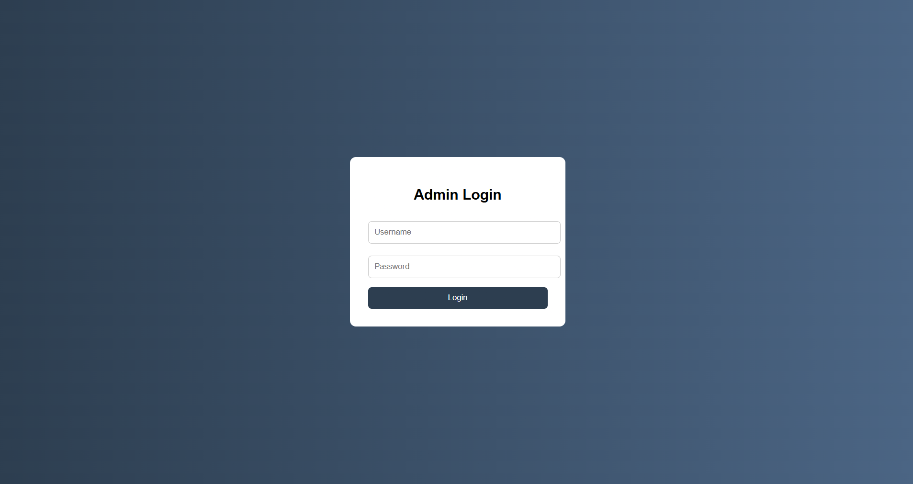
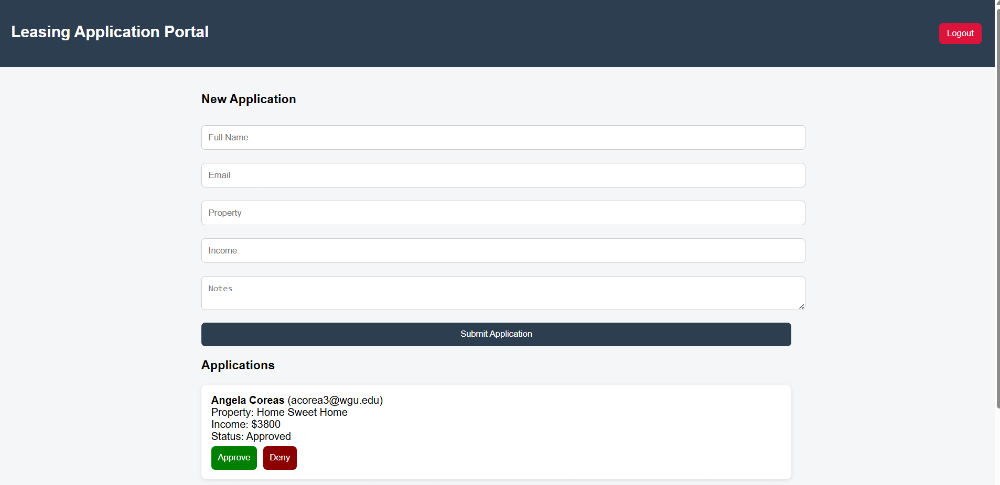

# 🏡 Leasing Application Portal

A responsive front-end web application that simulates a real-world apartment leasing application system. Users can log in, complete a rental application form, and receive validation feedback through an interactive and structured user interface.

This project demonstrates foundational software engineering skills in front-end development, including form handling, DOM manipulation, responsive design, and deployment using GitHub Pages.

---

## 🚀 Live Demo

👉 https://angelacoreas1989-boop.github.io/leasing-application-portal/

---

## 📌 Project Overview

The Leasing Application Portal is designed to replicate a simplified property management workflow used in real leasing systems. It allows users to interact with a login screen and complete a structured rental application form with validation feedback.

This project was built to strengthen my front-end development skills and to simulate real-world business workflows using vanilla JavaScript, HTML, and CSS.

---

## ✨ Features

- User login interface (front-end authentication simulation)
- Interactive rental application form
- Form validation and error handling
- Responsive design for desktop and mobile devices
- Clean UI that simulates real property management workflows

---

## 🛠️ Tech Stack

- HTML5
- CSS3
- JavaScript (Vanilla)
- Git & GitHub
- GitHub Pages (Deployment)

---

## 📸 Screenshots

### Login Page

### Application Form

---

## 🧠 What I Learned

- DOM manipulation using JavaScript
- Building and validating interactive forms
- Structuring a multi-file front-end project
- Debugging GitHub Pages deployment issues
- Using Git and GitHub for version control
- Improving UI/UX through iterative design

---

## 🚀 Future Improvements

- Add backend integration for storing applications
- Implement real authentication system (e.g., Firebase or Node.js backend)
- Create an admin dashboard for reviewing applications
- Improve accessibility (ARIA labels, keyboard navigation)
- Enhance UI with animations and improved UX design

---

## 📂 Project Structure
leasing-application-portal/
│
├── index.html
├── styles.css
├── script.js
├── /assets
│ ├── login.png
│ ├── form.png
└── README.md

---

## 👩🏽‍💻 Author

**Angela Coreas**  
Aspiring Software Engineer | Property Management Professional transitioning into Tech

---

## 📌 Note

This project reflects my journey transitioning from property management into software engineering and demonstrates my ability to build, deploy, and iterate on functional web applications.
