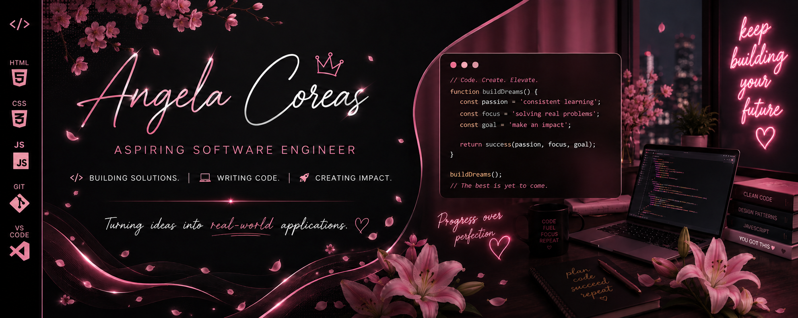
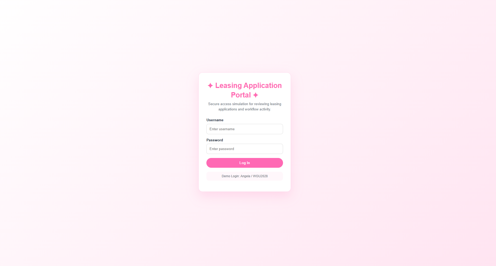
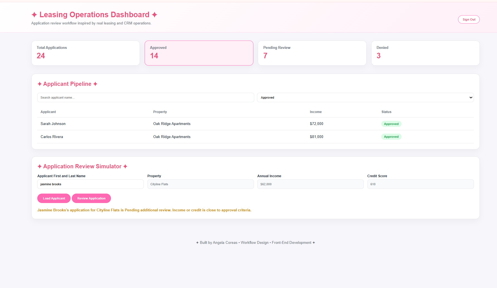

<p align="center">
  
</p>

<h1 align="center">✦ Leasing Application Portal ✦</h1>

<p align="center">
<b>Software Engineering Portfolio Project • Workflow Simulation • Frontend Development</b>
</p>

<p align="center">
Transforming real-world leasing operations into a functional web application.
</p>

---

## ✦ LIVE DEMO ✦

🔗 https://angelacoreas1989-boop.github.io/leasing-application-portal/

---

## ✦ PROJECT OVERVIEW ✦

The Leasing Application Portal is a responsive front-end web application that simulates a real-world leasing workflow used in property management operations.

Inspired by my professional experience in leasing, CRM systems, application processing, pipeline management, and workflow coordination, this project demonstrates how business processes can be translated into software solutions using HTML, CSS, JavaScript, Git, and GitHub Pages.

Users can log in, review applicant records, search application data, filter workflow statuses, load applicant profiles, and process leasing decisions through an interactive dashboard experience.

---

## ✦ BUSINESS PROBLEM ✦

Property management teams process large volumes of rental applications while maintaining accuracy, compliance, and operational efficiency.

This project simulates a simplified version of that workflow by providing a structured interface for application intake, validation, review, and status management. The goal was to model a familiar business process while strengthening software engineering fundamentals and front-end development skills.

---

## ✦ FEATURES ✦

✦ Secure login simulation

✦ Leasing operations dashboard

✦ Interactive applicant pipeline

✦ Applicant search functionality

✦ Status filtering through dashboard metrics

✦ Clickable Approved, Pending, and Denied workflow cards

✦ Applicant record lookup by name

✦ Automatic applicant data retrieval

✦ Application review simulator

✦ Approval, Pending Review, and Denial decision logic

✦ Sign Out workflow

✦ Responsive design for desktop and mobile devices

✦ GitHub Pages deployment

---

## ✦ TECH STACK ✦

<p align="center">
  
</p>

---

## ✦ SKILLS DEMONSTRATED ✦

✦ Front-End Development

✦ DOM Manipulation

✦ JavaScript Objects & Data Structures

✦ Event Handling

✦ Search & Filtering Logic

✦ Workflow Design

✦ Business Process Analysis

✦ User Interface Development

✦ Responsive Design

✦ Git Version Control

✦ GitHub Pages Deployment

---

## ✦ SCREENSHOTS ✦

### ✦ Login Screen ✦



### ✦ Leasing Operations Dashboard ✦



---

## ✦ WHAT I LEARNED ✦

✦ Building interactive user interfaces with JavaScript

✦ Structuring front-end projects using HTML, CSS, and JavaScript

✦ Designing software around real-world business workflows

✦ Implementing search, filtering, and decision logic

✦ Using JavaScript objects to simulate applicant records

✦ Improving user experience through responsive design

✦ Deploying and maintaining applications using GitHub Pages

✦ Using Git and GitHub for version control and project management

✦ Translating operational business processes into software solutions

---

## ✦ FUTURE ENHANCEMENTS ✦

✦ Backend database integration

✦ Real authentication system

✦ Applicant document uploads

✦ Administrative review dashboard

✦ Applicant notes and review comments

✦ Workflow analytics and reporting

✦ Property inventory management

✦ API integration for applicant data

---

## ✦ PROJECT STRUCTURE ✦

```text
leasing-application-portal/
├── assets/
│   ├── angela-coreas-banner.png
│   ├── login-screen.png
│   └── dashboard.png
├── index.html
├── dashboard.html
└── README.md
```

---

## ✦ AUTHOR ✦

**Angela Coreas**

Software Engineering Student • Operations & CRM Professional

LinkedIn:
https://www.linkedin.com/in/angela-coreas-550088186

GitHub:
https://github.com/angelacoreas1989-boop

Portfolio:
https://angelacoreas1989-boop.github.io/tech-portfolio/

---

<p align="center">
<i>✦ Building solutions • Writing code • Creating impact ✦</i>
</p>
